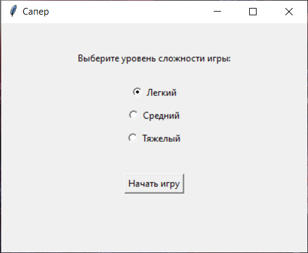
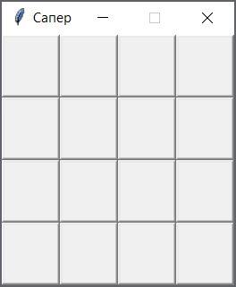
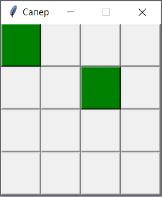
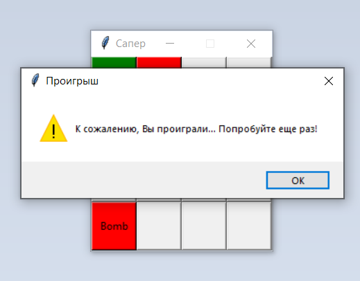
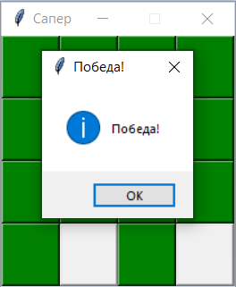

# Sapper (Python)
Игра "Сапер вслепую" на Python.
  

## Пример работы программы:

1. Запуск программы осуществляется через исполняемый файл Sapper.py. 

    *Для корректного запуска в системе должен быть установлен Python (https://www.python.org/downloads/).*

2. После запуска приложения, предлагается уровень сложности (чем сложнее уровень - тем больше само поле, которое надо обезвредить, а также на поле становится большее количество бомб):

    

3. Например, мы выбирали уровень игры "Легкий" и нажали "Начать игру". Появляется поле с игрой:

    

4. Начинаем играть. Задача: угадать, в каких квадратах нет бомбы. Кликаем на квадраты:

    

5. Если попадаем на бомбу, то игра заканчивается:

    

6. Если же правильно открываем все квадраты, где нет бомб, то мы выиграли:

    

7. Ура, игра пройдена!

